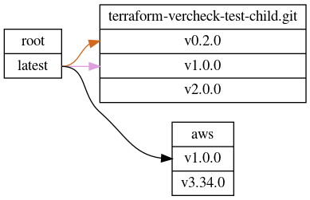

# terraform-vercheck

A tool for graphing relationships between entities in a terraform plan.

Currently supported:
  - Directory-based submodules (versioned by SEMVER git tags)
  - Providers (versioned by SEMVER in the terraform registry API)

## Details



Terraform-vercheck parses a terraform plan in a given directory and builds a
directed graph of the submodules and providers.

It recursively evaluates git-based submodules and can output a GraphViz DOT
file representing the graph.

It will have an exit code of 0
if everything is up to date with the latest version that vercheck can find.

## Usage

The quickest way to get going:

```
docker run ahraza/terraform-vercheck:latest -h
```

The only things you need are:

* Docker
* An SSH key to access GitHub with (this identity needs to be able to clone
repositories)

To actually run it against a terraform plan:

```
TF_PLAN_DIR=/path/to/terraform/plan/
SSH_DIR=~/.ssh/
SSH_FILE_NAME=terraform_vercheck_github_id_rsa
OUTPUT_DIR=$(pwd)/out/

docker run \
  -v ${TF_PLAN_DIR}:/plan/ \
  -v ${SSH_DIR}:/root/.ssh/ \
  -v ${OUTPUT_DIR}:/out/ \
  ahraza/terraform-vercheck:latest \
  -key /root/.ssh/${SSH_FILE_NAME} -directory /plan/ \
  -graph /out/graph.dot -log /out/vercheck.log
```

## Build tools & Installation

You can also build it from source and use it as a binary.

### Prequisites

* Golang: https://golang.org/doc/install (try Brew on OSX)
* GNU Make

### Instructions

To test, run `make test`.
To build, run `make build`. This will create a binary in the `build/`
subdirectory.

To create a docker image, run `make docker-build`.
To push the docker image run ` make docker-push`.

### Updating the Docker image

Run `bumpversion` to update the version tag in the Makefile. Then run `make docker-push`.
